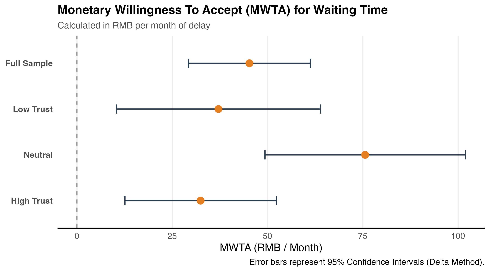

# How Waiting Time Shapes Preventive Health Behavior: Evidence from Vaccination Decisions

[](https://yichao2022.github.io/)
[](LICENSE)

This repository contains the replication code, methodology documentation, and key analytical findings for the research paper: **"How Waiting Time Shapes Preventive Health Behavior: Evidence from Vaccination Decisions"**.

## 📝 Abstract
Waiting time is a significant non-monetary friction in healthcare access. This study investigates how the shadow price of time influences vaccination decisions using a large-scale Discrete Choice Experiment (DCE). We find that waiting time significantly discourages vaccination uptake, with urban residents and individuals with lower institutional trust exhibiting higher sensitivity to delay. Our results highlight the importance of "Trust as a Psychological Buffer" in mitigating behavioral frictions.

---

## 🚀 Key Findings

### 1. The Monetary Valuation of Delay (MWTA)
We estimate the **Marginal Willingness to Accept (MWTA)** for waiting time. Our Mixed Logit models reveal a median valuation of approximately **47 RMB** per hour of delay, indicating a substantial behavioral shadow price.

### 2. Interaction Effects
- **Urban-Rural Psychology Divide**: Urban residents are significantly more sensitive to wait time ($p=0.029$, coeff=$-0.068$).
- **Trust as a Buffer**: High institutional trust acts as a psychological buffer, reducing the negative impact of wait time friction ($p=0.035$).

#### Visualizing the Behavioral Friction
Waiting time significantly discourages vaccination uptake, with the "behavioral tax" varying by institutional trust and socioeconomic context:
- **Main Effect**: Waiting time acts as a major deterrent to vaccine uptake, significantly flattening the adoption curve.
- **Trust as a Buffer**: High institutional trust significantly mitigates the negative impact of wait time ($p < 0.05$ in the three-group specification).
- **Economic Value (MWTA)**: The median Marginal Willingness to Accept (MWTA) for reducing wait time is approximately 47 RMB/hour, with significant heterogeneity across trust levels.

<p align="center">
  
  
  
</p>

---

## 🛠️ Repository Structure

- `/models`: Implementation of Structural Parameter Recovery and Mixed Logit models.
  - `discount_estimation.R`: Replicates the $\kappa=0.225$ finding (Hyperbolic vs Exponential fit).
  - `logit_analysis.R`: Main discrete choice modeling (Mixed Logit, Subgroups, MWTA).
  - `interaction_tests.R`: Subgroup interaction analysis for Gender, Urban/Rural, and Education.
  - `formal_pa_test.R`: Detailed interaction analysis for Physical Activity levels.
  - `seir_behavioral.R`: SEIR epidemic simulation integrated with behavioral delay functions.
- `/data_simulation`: 
  - `generate_synthetic_data.R`: Creates a synthetic dataset mirroring original survey statistics.
  - `synthetic_dce_data.csv`: The generated dataset for immediate replication testing.
- `/plots`: Code for generating interaction effect visualizations.
- `METHODOLOGY.md`: Detailed documentation on MWTA calculation and model selection.

---

## 💻 Getting Started

```bash
git clone https://github.com/yichao2022/JMP-Vaccination-WaitTime.git
cd JMP-Vaccination-WaitTime
pip install -r requirements.txt
```

---

## 🎓 Citation

If you find this research or code useful, please cite:

```bibtex
@article{jin2026waiting,
  title={How Waiting Time Shapes Preventive Health Behavior: Evidence from Vaccination Decisions},
  author={Jin, Yichao and Kim, Dohyeong and Tian, Zhen},
  year={2026},
  journal={Working Paper},
  url={https://yichao2022.github.io/}
}
```
