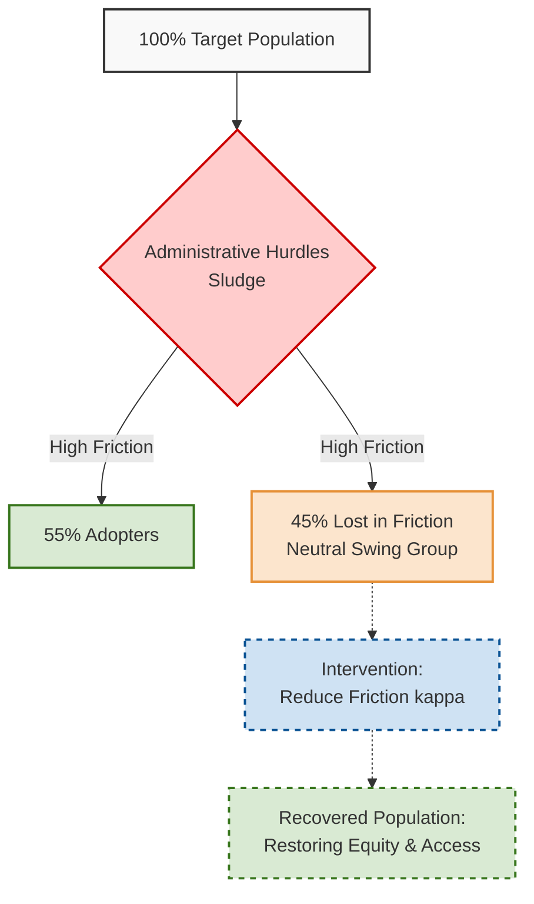

# Administrative Burden Diagnostics: Visualizing the Equity Gaps in Public Policy

## The "Administrative Sludge"

Public policy often focuses on the macro-level goals, but equity is determined in the micro-frictions of implementation. **"Administrative Sludge"** refers to the seemingly minor bureaucratic hurdles, paperwork, and logistical frictions in policy design that, cumulatively, lead to massive disparities in take-up among vulnerable populations. 

## The "Hidden Majority" (45%)

In my research examining intertemporal choices, a critical insight emerged: roughly **45% of the target population** are not actively opposed to policy goals (e.g., vaccination). Instead, they belong to a **"Neutral Swing Group"**.

These individuals are disproportionately paralyzed by administrative friction ($\kappa$) and generally exhibit lower baseline institutional trust ($\delta$). Because they lack strong proactive motivation, even minor barriers can indefinitely delay their compliance, causing them to fall through the cracks of public health initiatives.

## Structural Insights: The Cost of Friction

To quantify this, we look at the **Friction-Adjusted Utility**:

$$ U_{adj} = U(a) - \kappa_{sludge} $$

Where $U(a)$ represents the baseline utility of taking an action, and $\kappa_{sludge}$ represents the utility drain of navigating administrative hurdles.

By applying **$\beta-\delta$ modeling**, my structural framework reveals that administrative burdens do not affect all groups equally. Instead, they act as a **"tax on the poor and the time-constrained"**. For populations with high present-bias ($\beta$), immediate administrative costs heavily outweigh delayed health or economic benefits.

## Mapping the Equity Gap

The following flowchart illustrates the profound impact of administrative sludge on the population and how targeted friction-reduction interventions can reclaim the Neutral Swing Group.

## Call to Action

The evidence is clear: when we design policies without accounting for the true cost of administrative burdens, we fail our most vulnerable constituents. Redesigning policy for equity means aggressively auditing and eliminating sludge.

👉 **[Download the JMP (Policy & Equity Focus)](/jmp.pdf)**
