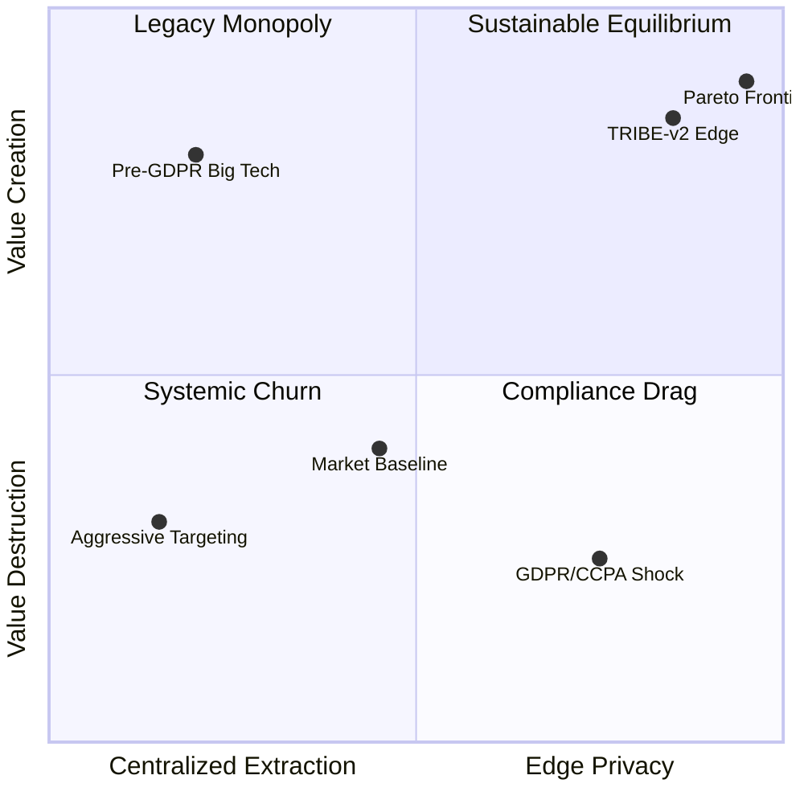

# Behavioral Digital Twins: Structural Realism in Digital Platforms

# The End of "Black-Box" Algorithmic Governance

Digital platforms increasingly rely on centralized, black-box algorithms for pricing, advertising, and recommendation. However, this paradigm faces a critical bottleneck: **The Privacy Paradox and Regulatory Friction**. As regulatory scrutiny tightens (e.g., GDPR, CCPA) and users demand data sovereignty, platforms can no longer freely extract high-resolution behavioral data to feed centralized predictive models. Furthermore, traditional live A/B testing—the standard industry tool for policy evaluation—is slow, costly, and risks systemic network churn when untested algorithmic changes or privacy policies are deployed in live environments.

We cannot rely on reduced-form machine learning models that merely predict *what* users did historically. To rigorously evaluate counterfactual policies—such as the impact of privacy regulations on digital advertising or algorithmic fairness—we must simulate *how* strategic agents adapt to entirely new systemic incentives under strict privacy constraints.

## The Solution: Privacy-Preserving Structural Simulation at the Edge

The **Trust-Reinforced Intertemporal Behavioral Engine (TRIBE-v2)** bridges the gap between high-dimensional behavioral economics and platform engineering. By replacing centralized data extraction with decentralized, local-compute simulation, we implement **Privacy by Architecture**. 

Instead of moving user data to the cloud, we move the *structural model* to the edge.

> *"We believe the future of Platform Economics lies in protecting the user's data sovereignty while maximizing the predictive power of structural behavioral models to evaluate regulatory and algorithmic shifts."*

By simulating individual life paths through the Bellman equations, TRIBE-v2 moves beyond mere prediction to diagnose the causal mechanisms of platform engagement. It isolates the deep structural parameters driving human choice in digital environments:
*   **$\beta$ (Present Bias):** The intertemporal discounting of delayed platform rewards versus immediate privacy costs.
*   **$\delta$ (Institutional Trust):** The user's dynamic belief in the platform's reliability and data stewardship.
*   **$\kappa$ (Administrative Sludge & Privacy Friction):** The asymmetric friction costs impeding user conversion (e.g., cookie consent fatigue).

### Technical Implementation: Massively Parallel Structural Solvers

To execute these multi-agent game-theoretic reactions at scale, TRIBE-v2 circumvents the computational bottlenecks of traditional nested fixed-point (NFXP) algorithms. By leveraging sparse matrix algebra and vectorized operators, the engine maps millions of state-transitions simultaneously, allowing "Digital Twin" environments to be executed entirely offline on local silicon (e.g., Apple Metal/MPS architectures).

```R
# ---------------------------------------------------------
# TRIBE-v2: Vectorized Edge-Compute Bellman Solver
# Designed for Privacy-Preserving Structural Inference
# ---------------------------------------------------------
require(Matrix)
require(parallel)

# Pre-allocate sparse transition matrices for O(1) state-space mappings
# Simulating N = 1,000,000 independent agent trajectories locally
transition_matrix <- sparseMatrix(i = states_from, 
                                  j = states_to, 
                                  x = transition_probs)

parallel_bellman_update <- function(V_current, policy_matrix, beta, delta) {
  # Vectorized Bellman operator replacing loop-based iterative bottlenecks
  # Captures forward-looking expectations under policy uncertainty: 
  # V_{t+1} = U(\kappa) + \beta \delta * (P %*% V_current)
  expected_V <- transition_matrix %*% V_current
  
  # Simultaneous policy update across the simulated cohort
  V_new <- policy_matrix + (beta * delta) * expected_V
  return(V_new)
}

# Offload matrix operations to parallel silicon cores (e.g., Apple MPS)
V_optimal_network <- mclapply(agent_cohorts, function(cohort) {
  parallel_bellman_update(cohort$V, cohort$policy, cohort$beta, cohort$delta)
}, mc.cores = detectCores())
```

This architecture provides a "Digital Wind Tunnel" for platform strategists and policymakers. It enables the stress-testing of privacy mandates, ad-targeting shifts, and nudge interventions in a mathematically rigorous sandbox *before* live deployment, ensuring both theoretical soundness and empirical scalability.

## Phase 3: Interactive Visualizations (Trust Buffer Effect under Privacy Friction)

The interactive 3D surface plot below demonstrates the power of Edge Simulation in the context of data privacy. It contrasts two scenarios:
1. **Cloud Model (High Privacy Risk)**: High data exposure risk amplifies the friction ($\kappa$) penalty (e.g., stringent consent pop-ups), leading to a steep drop-off in engagement and ad-effectiveness.
2. **Edge Model (TRIBE-v2)**: Local-compute neutralizes privacy concerns. Here, institutional trust ($\delta$) effectively buffers friction, restoring engagement for the critical 45% "neutral" user segment, offering a Pareto improvement for both platform revenue and consumer privacy.

<div class="my-8 w-full border border-slate-200 rounded-lg overflow-hidden shadow-sm" style="height: 650px;">
  <iframe src="./plot_3d.html" width="100%" height="100%" frameborder="0"></iframe>
</div>

## Counterfactual Policy Phase Space: Navigating Regulation

<div class="mermaid-container" style="margin: 2rem 0;">



</div>
<p align="center"><em><strong>Figure 2. Structural Policy Sandbox:</strong> This phase map illustrates system-wide equilibrium shifts when platforms face regulatory shocks like GDPR/CCPA. It demonstrates how traditional centralized extraction falls into systemic churn or legacy vulnerability, and how raw privacy mandates induce compliance drag. By integrating <strong>Edge Computing</strong> and mitigating <strong>Algorithmic Bias</strong>, TRIBE-v2 neutralizes privacy friction ($\kappa$) and leverages institutional trust ($\delta$) to guide platforms toward a Sustainable Pareto Equilibrium.</em></p>

---
*Powered by TRIBE-v2 (Trust-Reinforced Intertemporal Behavioral Engine) - Architected for Digital Privacy, Platform Economics, and Algorithmic Governance.*
